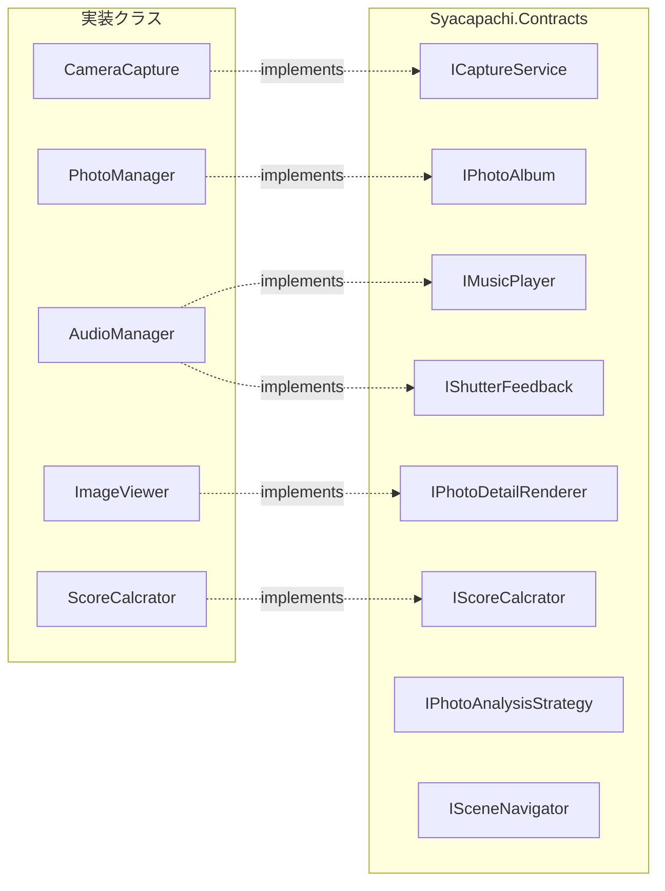
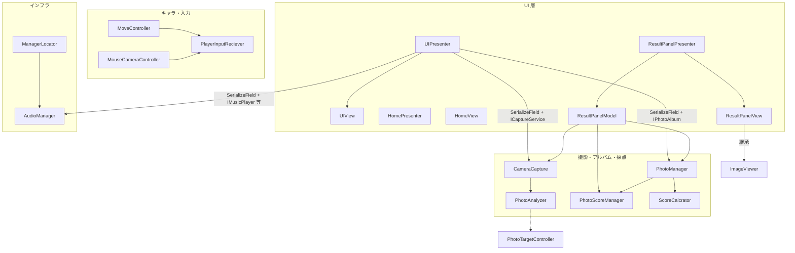

# 設計改善案（SOLID 原則に基づく）

本ドキュメントは、`Assets/Script` を中心とした**ファイル間依存**を整理し、[SOLID](https://en.wikipedia.org/wiki/SOLID) の各原則に照らした**改善の方向性**を示します。**契約（`Syacapachi.Contracts`）の導入やスコア周りの分離など、途中経過の反映済み項目**と、残タスクを分けて記載します。

---

## 1. 依存関係（概要・2026-03 時点）

### 1.1 契約レイヤ（`Syacapachi.Contracts` / `Assets/Script/interface`）と実装

インターフェースと、それを実装する `MonoBehaviour` の対応です。

`IPhotoAnalysisStrategy`・`ISceneNavigator` は**定義のみ**（`CameraCapture` への注入や `HomePresenter` からの利用は未接続）。

### 1.2 UI・撮影・スコアの実行時依存

### 1.3 スコア加算の流れ（改善後）

写真が `PhotoManager.AddPhoto` に入るタイミングで、`ScoreCalcrator`（`IScoreCalcrator`）によりオブジェクトごとのスコアを算出し、`PhotoScoreManager` が**オブジェクト単位の最大スコア**を保持します。`ResultPanelModel` は `PhotoScoreManager.TotalScore` を表示用に参照し、**撮影イベントの直接購読やスコア累積ロジックは持ちません**。

### 1.4 読み取れる構造・残りの論点

- **DIP / ISP の一部を反映**: `UIPresenter` は `ICaptureService`・`IPhotoAlbum`・`IMusicPlayer`・`IShutterFeedback` として振る舞い、`AudioManager` / `CameraCapture` / `PhotoManager` は対応する契約を実装している。インスペクタには引き続き具象が刺さる（Unity 都合）。
- **スコア責務の分離**: 集計は `PhotoScoreManager`、計算式の差し替え余地は `IScoreCalcrator` / `ScoreCalcrator` に寄せた。
- **撮影パイプライン**は依然として `CameraCapture` → `PhotoAnalyzer`（静的）→ `PhotoTargetController` / `PhotoTargetDataSO`。`IPhotoAnalysisStrategy` は**未配線**。
- **シーン遷移**は `HomePresenter` / `ResultPanelPresenter` が `SceneManager` を直接呼び出し。`ISceneNavigator` は未使用。
- **グローバル名前空間**（`UIPresenter` 等）と **`Syacapachi.*`** の混在は残っている。
- `PhotoAnalyzer` に **Editor 系 `using` が残存**している点は、Player ビルド観点では引き続き要確認（下記 §6）。

---

## 2. 単一責任の原則（SRP）

### 反映済み

- **`ResultPanelModel`**: アルバムからの写真列挙と `PhotoScoreManager` 経由のスコア表示に**薄く**なった（撮影イベント購読・自前累積から撤退）。
- **`PhotoScoreManager`**: オブジェクトごとのスコア保持・合計の再計算。
- **`PhotoManager.AddPhoto`**: 保存と同時に `ScoreCalcrator` で採点し `PhotoScoreManager` に渡す**オーケストレーション**。

### 残る課題

| クラス | 複数の責務の例 |
|--------|----------------|
| `UIPresenter` | カウントダウン、`IPhotoAlbum` 連携、シャッター演出（DOTween）、各パネル表示切替、`ICaptureService` イベント購読 |
| `CameraCapture` | レンダーターゲット操作、GPU 読み取り、エンコード、被写体解析の呼び出し、デバッグログ |
| `PhotoManager` | アルバム＋スコア連携の両方（やむを得ないが、さらに薄くするなら「アルバム専用」と「撮影後ハンドラ」の分離も検討） |

### 改善案

1. **カウントダウン**を `GameTimer` や `CountdownController` など独立コンポーネントに切り出し、`UIPresenter` は「表示更新の委譲」のみにする。
2. **テクスチャ取得**（`AsyncGPUReadback` ～ `Texture2D`）と **解析**（`PhotoAnalyzer` 呼び出し）を別クラスに分け、`CameraCapture` はオーケストレーションに限定する。
3. シーン読み込み順や非アクティブオブジェクトの初期化が再び問題になった場合は、**Composition Root** で明示的に `Initialize()` を呼ぶ形へ（旧 `RuntimeInitializeOnLoadMethod` パターンの置き換え）。

---

## 3. オープン・クローズドの原則（OCP）

### 反映済み

- **`IScoreCalcrator`**（命名はプロジェクト内スペルに合わせる）と **`ScoreCalcrator`** により、**1枚の写真内オブジェクトのスコア計算**を差し替え可能にした。`PhotoManager` は `ScoreCalcrator` を経由して `PhotoScoreManager` に渡す。

### 残る課題

- `PhotoAnalyzer` は引き続き **static**。被写体列そのものの取得経路は `CameraCapture` から直結のまま。`IPhotoAnalysisStrategy` は**未使用**。
- コンボ・時間ボーナスなど**セッション全体のルール**は `PhotoScoreManager` 側の拡張が必要。

### 改善案

1. `CameraCapture` が `PhotoAnalyzer` を直接呼ばず、**`IPhotoAnalysisStrategy` 実装**（または SO）を注入する。
2. ScriptableObject で **採点ポリシー**（重み付け、タグ別倍率）を持ち、`IScoreCalcrator` の実装を複数用意する。
3. ユニットテストが必要なら `PhotoAnalyzer` を**インスタンス＋インターフェース**へ移行する。

---

## 4. リスコフの置換原則（LSP）

### 現状の課題

- `ResultPanelView : ImageViewer` は継承で再利用している。子が `display` の意味を**上書き**（`AddPhotoData` で `base.display = rawImage`）しており、**基底の不変条件**が読み取りづらい。

### 改善案

1. **合成（コンポーネント参照）**に切り替え、`ImageViewer` を「詳細オーバーレイ用」として保持するだけにする。
2. 継続して継承する場合は、`ImageViewer` が **`IPhotoDetailRenderer` を実装**しているので、呼び出し側を可能な範囲で契約型に寄せ、**子で前提とする状態**をドキュメント／アサートで固定する。

---

## 5. インターフェース分離の原則（ISP）

### 反映済み

- `AudioManager` が **`IMusicPlayer`** と **`IShutterFeedback`** を実装し、`UIPresenter` は実行時ロジックでこれらの契約型のみ利用（インスペクタは `AudioManager` 具象のまま）。

### 残る課題

- SE が増えた場合、`AudioManager` が肥大化しやすい。**カテゴリ別インターフェース**や AudioMixer 連動の分割を検討。

### 改善案

1. 必要に応じて `IVoiceFeedback` など**さらに細い契約**に分割する。
2. Zenject / VContainer 等で**インターフェース型の注入**に移行し、SerializeField の具象依存を減らす。

---

## 6. 依存性逆転の原則（DIP）

### 反映済み（一部）

- `UIPresenter`・`ResultPanelModel` が **`ICaptureService` / `IPhotoAlbum`** を介して撮影・アルバム操作を参照。
- スコア計算が **`IScoreCalcrator`** に寄せられ、`PhotoManager` → `ScoreCalcrator` → `PhotoScoreManager` の流れになった。

### 残る課題

- インスペクタは依然として **`CameraCapture` / `PhotoManager` / `AudioManager` 具象**（Unity の制約と実用のバランス）。
- `ManagerLocator` は **サービスロケータ**のまま。依存が暗黙になりやすい。
- `PhotoAnalyzer` が **Editor 系 `using`（`UnityEditor` 等）を含む**可能性が残り、Player ビルド・依存関係の観点ではリスク。

### 改善案

1. **Composition Root**（シーン上の1オブジェクト等）で `IPhotoAlbum`, `ICaptureService`, `IScoreCalcrator` 等を**明示的に結線**する。
2. `ManagerLocator` を**初期化専用**に限定するか、インターフェース取得に置き換える。
3. **`ISceneNavigator` 実装**（例: `UnitySceneNavigator`）を追加し、`HomePresenter` / `ResultPanelPresenter` の `SceneManager` 直参照を置換する。
4. `PhotoAnalyzer` から **未使用の Editor / VisualScripting / EventTrigger の using を削除**する。`ResultPanelView` に Editor 依存が残っていないかもビルドで確認する。

---

## 7. 優先度の目安

| 優先度 | 内容 | 理由 |
|--------|------|------|
| 高 | `PhotoAnalyzer` の **Editor 系 using の整理** | Player ビルド・CI の安定に直結 |
| 高 | `CameraCapture` と **`PhotoAnalyzer` / `IPhotoAnalysisStrategy` の配線** | 解析差し替え・テスト容易性 |
| 中 | `UIPresenter` の **タイマー / 演出 / パネル**の分割 | SRP・可読性 |
| 中 | **`ISceneNavigator` 実装**と `HomePresenter` / `ResultPanelPresenter` からの利用 | DIP・モック容易性 |
| 低 | 名前空間の統一（`Syacapachi.Gameplay.*` 等） | 探索性・チーム運用 |
| 済（参考） | オーディオの **ISP（`IMusicPlayer` / `IShutterFeedback`）**、アルバム・撮影の **契約型**、スコアの **`IScoreCalcrator` + `PhotoScoreManager`** | 既に反映済み。保守時はここを起点に拡張する |

---

## 8. まとめ

**Presenter + View + SerializeField** を維持しつつ、`Syacapachi.Contracts` で **撮影・アルバム・オーディオ・スコア計算**の境界が一段はっきりしました。次の費用対効果が高いのは、**(1) `PhotoAnalyzer` のランタイム安全性（Editor using の整理）**、**(2) `IPhotoAnalysisStrategy` / `ISceneNavigator` の実装と配線**です。スコアは `PhotoScoreManager` に集約されたため、ルール追加は主にそこと `IScoreCalcrator` 実装の追加で済ませやすくなっています。
